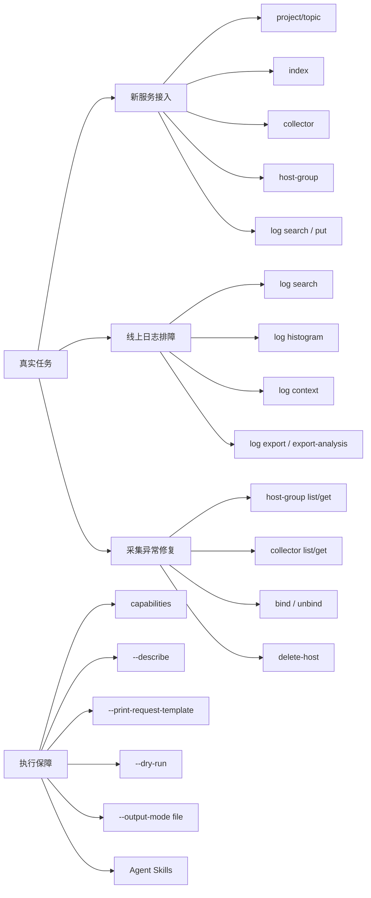

# 把 TLS 装进终端：volclog CLI 实战指导

> <u>***这篇文档不打算按 API 清单展开，而是想把几条最常见的 TLS 实战链路讲清楚：怎么接入、怎么排障、怎么导出、怎么让 Agent 少走弯路。***</u>

> [!NOTE]
> **阅读指南**
>
> 这篇文章讲什么？
>
> 这篇文档更关心 `volclog` 在真实使用里的样子：当 TLS 操作跨了多个资源、多个步骤、还夹着几段 JSON body 时，它怎么帮你把事情做顺，而不是只展示零散的 `list/create/search`。
>
> **看完能收获什么？**
>
> - 5 分钟完成安装、凭证配置与首次验证
> - 理解 `shortcut -> api --describe -> api call` 的三层命令架构
> - 掌握 3 条常用实战链路：新服务接入、线上排障、采集异常修复
> - 明白 Agent 接入 `volclog` 后到底少猜了什么、少踩了什么坑
>
> **预计阅读时间：**通读 `18` 分钟 / 快速浏览 `8` 分钟 / 只看工作流 `10` 分钟

---

## 概述

`volclog` 是火山引擎 TLS（日志服务）官方 CLI。它当然可以做 `project list`、`topic create`、`log search` 这类常规动作，但这篇文档不准备把它写成一份接口目录。

更值得关注的是，下面这几件事在 `volclog` 里被放到了一条比较顺的执行路径上：

- `shortcut`：把高频场景压成更短、更稳的命令入口
- `capabilities`、`--describe`、`--print-request-template`、`--dry-run`：把“发现约束、拿模板、校验请求”做成 CLI 原生能力
- `skills`：把这些执行习惯交给 Agent，让它优先选对 group、少猜 body、遇到大结果自动落文件

对于已经习惯 Bash、curl 或友商 CLI 的用户来说，是否值得试，不太取决于“是不是又多了一条 `log search` 命令”，而更取决于下面这些场景能不能省事：

- 新建一个日志接入链路时，不再来回翻控制台和 OpenAPI 文档找字段
- 线上排障时，不再临时拼凑多条命令、手写 JSON、手工翻页和导出
- 交给 Agent 执行时，不再担心它直接猜参数、漏资源、把大结果全打到 stdout

下面这张图展示了 `volclog` 更适合解决的问题：



一句话概括：

**如果只是查一个资源，很多工具都能做；如果你经常要把几步 TLS 操作串起来做，`volclog` 会更顺手一些。**

## 为什么可能值得试试

和常见的 TLS CLI、Shell 脚本相比，`volclog` 的差异不在覆盖范围，而在执行体验和失败成本。

| 维度 | 常见 CLI / Bash 脚本 | `volclog` |
| --- | --- | --- |
| 高阶入口 | 通常只有资源 CRUD | 有 `shortcut`，直接对准高频任务 |
| 复杂请求体 | 需要翻 API 文档、手写 JSON | `--describe` + `--print-request-template` 直接给约束和模板 |
| 执行前校验 | 往往直接发请求 | `--dry-run` 先在本地校验 |
| 大结果处理 | 容易直接打 stdout 或自己分页导出 | `--output-mode file` 适合大结果，`log export` 已支持分页批次写文件 |
| Agent 接入 | 需要额外写 prompt/胶水层 | 内置 `skills/`，能把最佳实践直接交给 Agent |
| 发现能力 | 靠文档和记忆 | `capabilities --view groups` / `--group <x>` 可直接探索 |

如果你的现状是：

- 小事情靠控制台
- 大事情靠自己攒 Bash
- 交给 Agent 时靠它“猜测 API”

那 `volclog` 更适合补上的是后两者。

---

## 5 分钟完成可用环境

这一章只保留最短路径，后面把篇幅更多留给实战链路。

### Step 1：安装 CLI

推荐直接安装二进制：

```bash
VOLCLOG_BASE_URL=https://github.com/volcengine-tls/ve-tls-cli/releases/latest/download bash scripts/install-binary.sh
```

如果你更习惯 npm：

```bash
npm install -g @volcengine-tls/volclog
```

如果你已经有 Go 1.22+，也可以：

```bash
go install github.com/volcengine-tls/ve-tls-cli/cmd/volclog@latest
```

验证：

```bash
volclog --version
```

### Step 2：配置凭证

最直接的方式是写一个默认 profile：

```bash
volclog configure set \
  --profile default \
  --ak <ak> \
  --sk <sk> \
  --region cn-beijing \
  --endpoint https://tls-cn-beijing.volces.com
```

如果你有多环境需求，建议一开始就按下面的规则选：

- 本地长期使用：`configure set`
- 多个 profile 复用同一套凭证：`--cred-ref`
- CI / Agent / 临时执行：环境变量或 `--secrets-file`

例如：

```bash
export VOLCENGINE_ACCESS_KEY_ID=<ak>
export VOLCENGINE_ACCESS_KEY_SECRET=<sk>
volclog project list
```

### Step 3：先跑健康检查

```bash
volclog doctor
```

`doctor` 是 `volclog` 最应该先跑的命令之一。凭证、region、endpoint、profile 链路有问题时，它比业务命令更容易定位根因。

### Step 4：做第一次真实请求

```bash
volclog project list --all
```

如果这里都不通，不要继续看 `topic`、`index`、`log`，先回去修 `doctor` 暴露的问题。

### Step 5：按需安装 Agent Skills

如果你要把 `volclog` 交给 Agent，这一步值得做；如果你只做人类手工使用，可以先跳过。

安装到 Agent 的全局目录：

```bash
volclog skill install --dir /path/to/agent/global-skills
```

如果你还没全局安装 CLI，只想先装一次 skill，也可以直接：

```bash
npx @volcengine-tls/volclog skill install --dir /path/to/agent/global-skills
```

安装到当前项目目录：

```bash
volclog skill install --dir ./skills
```

这一步重点不在“文件装到哪个目录”，而在于把下面这些执行习惯交给 Agent：

- 先选对 `group`
- 先看 `--describe`
- 复杂 body 先拿模板
- 正式执行前先 `--dry-run`
- 结果过大时优先 `--output-mode file`

---

## 三层命令架构

`volclog` 的命令设计遵循三层递进：

### 第一层：Shortcut

适合高频场景，优先使用。

例如：

```bash
volclog project list --all
volclog topic create --describe
volclog log export --describe
volclog collector bind-host-groups --describe
```

特点：

- 命令短
- 贴近任务语义
- 是人类和 Agent 的第一优先级入口

### 第二层：Generated API

当 shortcut 没覆盖，或者你要精确控制某个 OpenAPI action 时，再进入这一层。

例如：

```bash
volclog capabilities --group collector --view text
volclog api collector CreateRule --describe
volclog api host-group ApplyHostGroupToRules --print-request-template=full
```

特点：

- 与平台 action 一一对应
- 能看到更完整的参数约束
- 适合复杂 body 或低频动作

### 第三层：Raw API

只在你已经明确 `method + path` 时使用：

```bash
volclog api call --method GET --path /DescribeProjects
```

特点：

- 灵活度最高
- 出错概率也最高
- 不应该作为默认入口

选择策略只有一句话：

**先 shortcut，再 `api --describe`，最后才是 `api call`。**

---

## 三个实用工作流

如果你平时更关心实战，可以直接从这一章开始看。

### 工作流 1：把一个新服务接入 TLS，并完成检索验证

下面按一条完整接入链路来走：

**找到项目 -> 创建 topic -> 配置索引 -> 创建采集规则 -> 绑定机器组 -> 验证日志能被检索**

#### Step 1：确认项目

```bash
volclog --output table project list --all
```

如果没有合适项目，再创建：

```bash
volclog project create --describe
volclog project create --print-request-template=full > project_req.json
volclog --dry-run project create --request file://project_req.json
volclog project create --request file://project_req.json
```

#### Step 2：创建日志主题

```bash
volclog topic create --describe
volclog topic create --print-request-template=full > topic_req.json
volclog --dry-run topic create --request file://topic_req.json
volclog topic create --request file://topic_req.json
```

#### Step 3：给主题配置索引

这是最容易“猜 body 猜错”的一步，应该直接走模板：

```bash
volclog index create --describe
volclog index create --print-request-template=full > index_req.json
volclog --dry-run index create --topic-id <TopicId> --request file://index_req.json
volclog index create --topic-id <TopicId> --request file://index_req.json
```

#### Step 4：找到目标机器组

```bash
volclog host-group list --all \
  --jmes-filter "HostGroupHostsRulesInfos[].HostGroupInfo.{HostGroupId: HostGroupId, HostGroupName: HostGroupName}"
```

这一步体现了 `--all` 的必要性：不翻完整分页，Agent 和人都很容易误判“资源不存在”。

#### Step 5：创建采集规则并绑定机器组

```bash
volclog collector create --describe
volclog collector create --print-request-template=full > collector_req.json
volclog --dry-run collector create --request file://collector_req.json
volclog collector create --request file://collector_req.json

volclog collector bind-host-groups --describe
volclog collector bind-host-groups --rule-id <RuleId> --host-group-ids '["<HostGroupId>"]'
```

#### Step 6：先验证索引是否生效，再判断采集是否正常

这里最好把两件事分开看：

- `log put` 适合验证 topic 写入链路和索引检索是否正常
- 采集规则是否真的采到了机器日志，不能只靠 `log put` 判断

如果你刚完成的是 `topic + index` 配置，最直接的办法是先手动写一条测试日志，确认这条日志能被检索到：

```bash
volclog log put --topic-id <TopicId> --request-format jsonl --request file://./smoke.jsonl
```

然后马上检索确认：

```bash
volclog log search \
  --topic-id <TopicId> \
  --query "*" \
  --from <StartTimeMs> \
  --to <EndTimeMs> \
  --limit 20
```

这一步更接近“索引配置是否已经能支撑检索”，而不是“采集规则是否生效”。

如果你要确认的是采集链路本身，建议换成下面这套思路：

1. 在采集规则实际匹配的日志文件里追加一条带唯一标记的测试行。
2. 等一个短暂采集窗口后，用这个唯一标记做 `log search`。
3. 如果搜不到，再回头查 `collector get`、`host-group get` 和绑定关系，而不是先怀疑索引。

例如，真实排查时更像这样：

```bash
# 在目标机器的真实日志文件里追加一条唯一标记
echo 'volclog-smoke-check trace_id=smoke-001 status=ok' >> /path/to/real/app.log

# 回到 CLI 里按唯一标记检索
volclog log search \
  --topic-id <TopicId> \
  --query 'smoke-001' \
  --from <StartTimeMs> \
  --to <EndTimeMs> \
  --limit 20
```

如果这一步还没有结果，再去看配置细节：

```bash
volclog collector get --rule-id <RuleId> --output-mode file --output-file ./collector_rule.json
volclog host-group get --host-group-id <HostGroupId> --output-mode file --output-file ./host_group.json
```

#### 这条链路里，`volclog` 顺手的地方

你做完的不是单个资源操作，而是一条横跨 `project / topic / index / collector / host-group / log` 的接入链路。

如果把这件事交给 Agent，`volclog` 的收益也更明显。一个典型的 Agent 请求会是：

> 帮我把 payment-service 接到 TLS，复用现有机器组，把日志落到新 topic，并验证能查到测试日志。

安装好 `skills` 后，Agent 的典型执行顺序应该是：

```bash
volclog capabilities --view groups
volclog project list --describe
volclog topic create --describe
volclog index create --describe
volclog host-group list --describe
volclog collector create --describe
volclog collector bind-host-groups --describe
volclog log search --describe
```

省心的地方主要在于：先用哪个 group、哪个动作、body 从哪里起步、哪些命令最好先 `--dry-run`，这些都更容易收敛下来。

### 工作流 2：从告警到证据，把线上日志问题导出成可分析结果

下面这条链路更像一次完整排障，而不是单独跑一条 `search`：

**给定时间窗和查询条件 -> 看命中样本 -> 看时间分布 -> 导出原始样本 -> 导出聚合结果**

#### Step 1：先做快速检索

```bash
volclog --output table log search \
  --topic-id <TopicId> \
  --query "level:error" \
  --from <StartTimeMs> \
  --to <EndTimeMs> \
  --limit 20
```

这一步的意义是先确认“是否真的有命中”和“命中大概长什么样”，而不是一上来就大导出。

#### Step 2：看时间分布，确认是不是尖峰故障

```bash
volclog log histogram \
  --topic-id <TopicId> \
  --query "level:error" \
  --from <StartTimeMs> \
  --to <EndTimeMs> \
  --interval 60
```

这一步特别适合判断：

- 是瞬时抖动，还是持续异常
- 是单一时间点爆发，还是全时间窗都有问题

#### Step 3：导出原始样本

```bash
volclog --output jsonl --output-mode file --output-file ./error-samples.jsonl \
  log export \
  --topic-id <TopicId> \
  --query "level:error" \
  --from <StartTimeMs> \
  --to <EndTimeMs>
```

如果结果可能很大，不要直接打 stdout。`log export` 的文件模式已经支持分页批次写文件，更适合大结果导出。

#### Step 4：导出聚合分析结果

```bash
volclog --output jsonl --output-mode file --output-file ./error-summary.jsonl \
  log export-analysis \
  --topic-id <TopicId> \
  --query "* | select status, count(*) as cnt group by status order by cnt desc limit 20" \
  --from <StartTimeMs> \
  --to <EndTimeMs>
```

这里要记住一个常见坑：

- `analysis` 结果里的字段可用性依赖索引配置里的 `SqlFlag`
- 新加索引字段通常对增量日志更快生效，旧日志可能仍然是 `null`

#### Step 5：如果已经拿到命中样本，再追上下文

```bash
volclog log context --describe
volclog log context \
  --topic-id <TopicId> \
  --context-flow <ContextFlow> \
  --source <Source> \
  --package-offset <PackageOffset> \
  --prev-logs 20 \
  --next-logs 20
```

这一步更适合在确认某条异常日志后，再拉出前后文，不适合作为第一步。

#### 这条链路里，`volclog` 比较好用的地方

很多工具都能做一条 `search`，但排障往往不是一条命令就结束，而是要把“搜索、观察、导出、分析、上下文”几步连起来。

如果交给 Agent，一个高质量的请求通常是：

> 帮我排查过去 30 分钟 payment-service 的 5xx 错误，先看时间分布，再把样本和聚合结果导出到本地文件。

`volclog` 在这里更有帮助的地方，不是替代判断，而是让 Agent 更容易把下面这些步骤走稳：

- 先用 `search` 看样本，而不是直接大导出
- 导出时优先 `--output-mode file`
- 聚合查询自动切到 `export-analysis`
- 大结果优先落 JSONL 文件，而不是先把 stdout 或内存顶满

### 工作流 3：机器组有了、规则也有了，但日志就是没进来

这是 TLS 接入里很常见的一类问题。重点通常也不只是“查一下规则详情”，而是把下面几步串起来：

**查机器组 -> 查规则 -> 看绑定关系 -> 修绑定 -> 清理坏主机 -> 再验证**

#### Step 1：列出机器组，并优先拿完整列表

```bash
volclog host-group list --all \
  --jmes-filter "HostGroupHostsRulesInfos[].HostGroupInfo.{HostGroupId: HostGroupId, HostGroupName: HostGroupName}"
```

如果你怀疑返回对象层级复杂，不要硬读 stdout，直接把详情写文件：

```bash
volclog --output-mode file --output-file ./host-group.json \
  host-group get --host-group-id <HostGroupId>
```

#### Step 2：列规则并定位目标采集规则

```bash
volclog collector list --all --project-id <ProjectId>
volclog --output-mode file --output-file ./collector-rule.json \
  collector get --rule-id <RuleId>
```

#### Step 3：修复绑定关系

从规则侧绑定机器组：

```bash
volclog collector bind-host-groups --describe
volclog collector bind-host-groups --rule-id <RuleId> --host-group-ids '["<HostGroupId>"]'
```

从机器组侧绑定规则：

```bash
volclog host-group bind-rules --describe
volclog host-group bind-rules --host-group-id <HostGroupId> --rule-ids '["<RuleId>"]'
```

解绑同理：

```bash
volclog collector unbind-host-groups --rule-id <RuleId> --host-group-ids file://./host_group_ids.json
volclog host-group unbind-rules --host-group-id <HostGroupId> --rule-ids file://./rule_ids.json
```

#### Step 4：必要时清理失效主机

```bash
volclog host-group delete-host --host-group-id <HostGroupId> --ip <StaleIp>
```

#### Step 5：回到日志层验证

```bash
volclog log search \
  --topic-id <TopicId> \
  --query "*" \
  --from <StartTimeMs> \
  --to <EndTimeMs> \
  --limit 20
```

#### 这条链路里，`volclog` 的用处

麻烦的地方往往不是“有没有这个接口”，而是你需要在 `host-group` 和 `collector` 两个视角之间反复核对关系。

这也是最适合交给 Agent 的场景之一。好的 Agent 不该直接猜 `/DescribeRules` 或随手拼 JSON，而应该：

```bash
volclog capabilities --group host-group --view text
volclog capabilities --group collector --view text
volclog host-group list --describe
volclog collector list --describe
volclog collector bind-host-groups --describe
volclog host-group bind-rules --describe
```

这也是 `skills` 更实际的作用：不是替 Agent 执行，而是先把路走对。

---

## Agent 在这里能帮上什么忙

这一节主要回答一个更实际的问题：装完 skills 之后，Agent 到底会比“裸调 CLI”好在哪里。

### 1. 少做“先用哪个 group / action”的猜测

没有 guidance 的 Agent，很容易把“看机器组和采集规则关系”误判成底层 API 探索问题。

而安装了 `volclog-shared`、`volclog-host-group`、`volclog-collector` 之后，Agent 更容易先走：

```bash
volclog host-group list --describe
volclog collector list --describe
```

这样比直接跳到 `api call` 稳一些。

### 2. 少做“复杂 body 从哪里起步”的试错

像 `index create`、`collector create` 这类命令，费时间的通常是 body，不是动作名。

`volclog` 的更优路径是：

```bash
volclog collector create --describe
volclog collector create --print-request-template=full
volclog --dry-run collector create --request file://collector_req.json
```

对 Agent 来说，这比“先猜一个 JSON，再被 `InvalidArgument` 打回”稳得多。

### 3. 大结果处理更容易收住

TLS 场景里比较常见的问题是：

- 结果太大，全打到 stdout
- Agent 忘记落文件
- 导出逻辑先全量吃进内存

`volclog` 的建议路径是：

```bash
volclog --output jsonl --output-mode file --output-file ./logs.jsonl log export ...
volclog --output jsonl --output-mode file --output-file ./analysis.jsonl log export-analysis ...
```

对 Agent 来说，这比“先搜索，再把大段结果塞进自己的上下文里处理”可控得多。

### 4. 更不容易因为列表漏页而误判

当动作是 `Describe...s` 或 `list` 时，Agent 很容易忘记翻页。

`volclog` 文档和 skills 都应该强调：

- 列表先考虑 `--all`
- 深层对象优先 `--output-mode file`
- 只拿关键字段时再加 `--jmes-filter`

这通常不是风格偏好，而是正确性问题。

---

## Skills 与集成

`skill install` 不是这篇文档的重点，但在 Agent 场景里，它还是很有必要的配套能力。

### 安装到全局目录

适合个人长期复用：

```bash
volclog skill install --dir /path/to/agent/global-skills
```

如果你是一次性执行，也可以直接用：

```bash
npx @volcengine-tls/volclog skill install --dir /path/to/agent/global-skills
```

### 安装到项目目录

适合团队仓库内固化：

```bash
volclog skill install --dir ./skills
```

同样可以写成：

```bash
npx @volcengine-tls/volclog skill install --dir ./skills
```

### 按需安装最小集合

如果你只想先试一条完整链路，建议先装这几个：

```bash
volclog skill install \
  --dir ./skills \
  --name volclog-shared \
  --name volclog-project \
  --name volclog-topic \
  --name volclog-index \
  --name volclog-log \
  --name volclog-host-group \
  --name volclog-collector
```

这组 skill 已经足够覆盖本文的三个核心工作流。

---

## 常见误区

### 1. 把 `volclog` 当成另一份 TLS API 目录

这样用当然也能 work，但会比较难体会到它在多步骤场景里的好处。

### 2. 直接猜 body，不走 `--describe`

对 `index`、`collector`、低频 `api action` 尤其危险。

### 3. 列表动作忘记 `--all`

这会直接导致资源漏看，进而让人和 Agent 都误判“不存在”。

### 4. 大结果直接打 stdout

更稳的默认姿势是：

```bash
--output-mode file --output-file <path>
```

### 5. 装了 skill，却没有把它当成执行规则

`skill install` 的意义不只是把文件放进去，而是把“先 shortcut、再 describe、再 template、再 dry-run”这套顺序交给 Agent。

---

## 如果你只记住 6 条命令

```bash
volclog doctor
volclog capabilities --view groups
volclog <shortcut> --describe
volclog --dry-run <command>
volclog --output-mode file --output-file <path> <command>
volclog skill install --dir ./skills
```

这六条命令背后，其实是一种比较朴素的用法：

**不要只把 `volclog` 当作一个“能查日志的 CLI”，更可以把它当作一套把 TLS 工作流走顺的执行面。**

## 进一步阅读

- 基础安装与能力总览：[README_CN.md](../README_CN.md)
- 参数、输出与自动化建议：[cli-best-practices.md](cli-best-practices.md)
